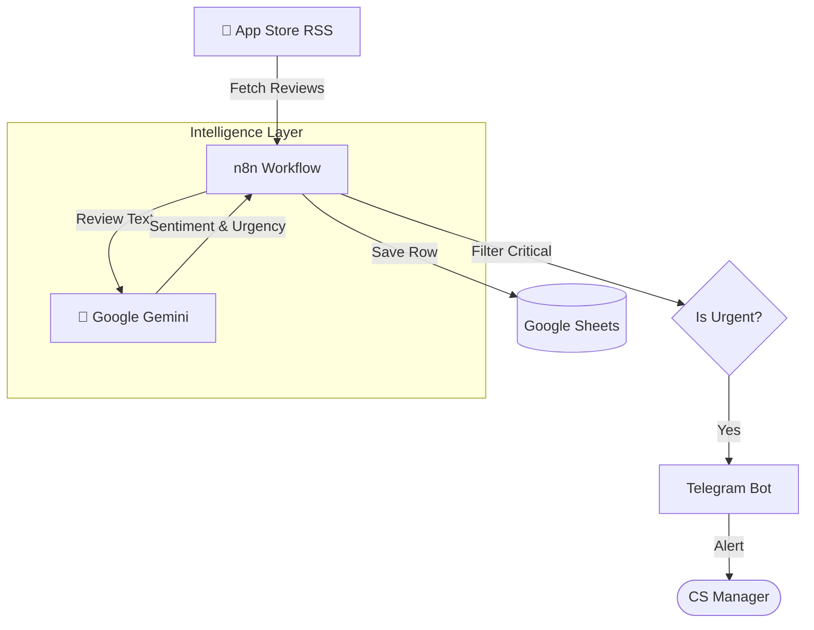

# VoC-Radar

<div align="center">
  
  
  <br />

  
  
  
</div>

<br />

**VoC-Radar**는 **iTunes App Store 리뷰**를 실시간으로 모니터링하고 분석하는 **자동화 에이전트**입니다.
Google Gemini API를 통해 고객 리뷰의 감정과 의도를 분석하고, 긴급 이슈(Critical) 감지 시 텔레그램으로 즉시 알림을 발송하여 운영팀의 신속한 대응을 지원합니다.

---

## 🛠 Features

*   **Automated Review Collection**: 매일 앱스토어 RSS 피드에서 최신 리뷰 데이터를 수집하여 누락 없이 관리
*   **AI Sentiment Analysis**: Google Gemini를 활용해 리뷰의 긍/부정 감정, 긴급도(Criticality), 주요 키워드 자동 태깅
*   **Deduplication Storage**: Google Sheets를 Database로 활용하여 리뷰 중복을 제거하고 데이터를 구조화하여 누적
*   **Critical Alerts**: 별점 1~2점 및 '심각' 판정된 리뷰 발생 시 담당자에게 텔레그램 푸시 알림 전송
*   **Full Automation**: n8n 워크플로우를 통해 수집-분석-저장-알림의 전 과정을 100% 자동화

---

## 🏗 Architecture



---

## 📦 Tech Stack

| Category | Technology |
| :--- | :--- |
| **Orchestration** | n8n |
| **AI Model** | Google Gemini API |
| **Data Source** | iTunes RSS API |
| **Storage** | Google Sheets API |
| **Notification** | Telegram Bot API |

---

## 🚀 Getting Started

### Prerequisites
*   n8n Instance
*   Google Gemini API Key
*   Google Cloud Console (Sheets API)
*   Telegram Bot Token

### Installation

1.  **Repository Clone**
    ```bash
    git clone https://github.com/jeonsavvy/VoC-Radar.git
    cd VoC-Radar
    ```

2.  **Import Workflow**
    *   n8n 대시보드 > **Workflows** > **Import from File**
    *   `workflow.json` 파일 업로드

3.  **Credentials Setup**
    *   **Google Gemini**: API Key 등록 (Header Auth)
    *   **Google Sheets**: OAuth2 자격 증명 설정
    *   **Telegram**: Bot Token 등록

4.  **Configure Nodes**
    *   `Get Reviews`: 타겟 앱 ID 수정
    *   `Sheet Append`: 저장할 Google Sheet ID 연결
    *   `Telegram`: 수신할 Chat ID 설정

5.  **Run Automation**
    *   **Execute Workflow** 버튼으로 테스트 실행 후 **Active** 전환

---

## 📂 Directory Structure

```bash
├── assets/              # Demo Images
├── workflow.json        # Main n8n Workflow
└── README.md
```

> [!NOTE]
> **Limitations**: iTunes RSS API는 최근 50개의 리뷰만 제공하므로, 리뷰 유입이 폭증하는 대형 앱의 경우 주기(Interval)를 짧게 설정해야 합니다.
