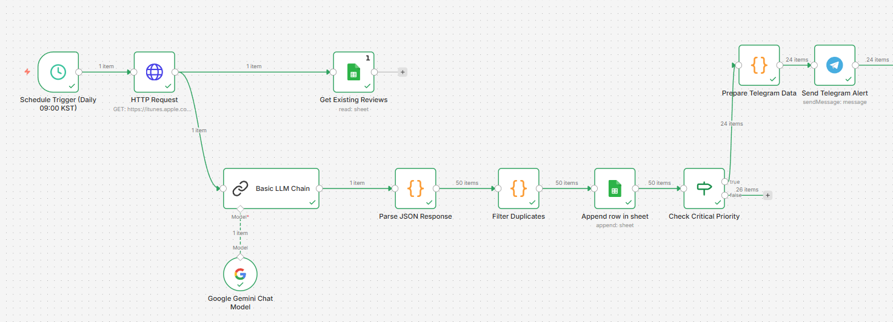
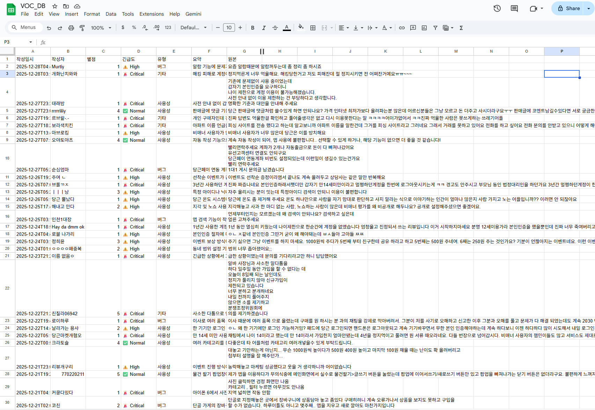
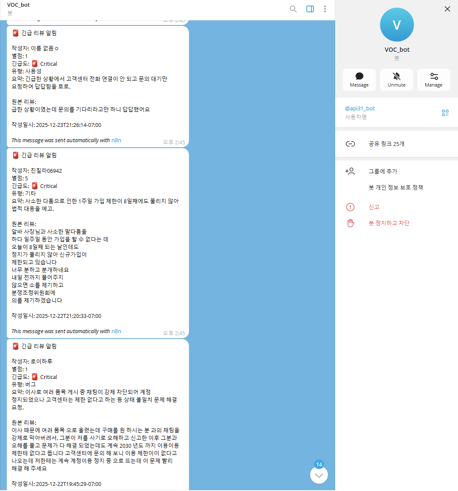

## 📝 프로젝트 소개 (Executive Summary)

> **"앱스토어 리뷰 자동 모니터링 에이전트"**

**VoC-Radar**는 **운영팀**을 위한 **리뷰 모니터링 자동화 시스템**입니다. **n8n 워크플로우와 Google Gemini API**를 활용하여 **앱스토어 리뷰의 수동 확인 작업**을 해결하고, 결과적으로 **실시간 알림과 자동화된 분석을 통한 신속한 대응**을 제공합니다.

* **제작:** jeonsavvy@gmail.com

---

## ✨ 핵심 기능 (Key Features)

<table>
  <tr>
    <td align="center" width="50%">
      <h3>🔹 자동 리뷰 수집 및 분석</h3>
      <p>iTunes App Store RSS API에서 최신 리뷰를 수집하고, Google Gemini AI로 긴급도와 유형을 자동 분석합니다.</p>
    </td>
    <td align="center" width="50%">
      <h3>🔹 중복 제거 및 데이터 관리</h3>
      <p>Google Sheets에 구조화된 형식으로 저장하여 중복을 제거하고 데이터를 누적 관리합니다.</p>
    </td>
  </tr>
  <tr>
    <td align="center" width="50%">
      <h3>🔹 실시간 알림</h3>
      <p>Critical 긴급 리뷰 발견 시 텔레그램 봇을 통해 즉시 알림을 전송합니다.</p>
    </td>
    <td align="center" width="50%">
      <h3>🔹 워크플로우 자동화</h3>
      <p>리뷰 수집부터 분석, 저장, 알림까지 전체 프로세스를 자동화합니다.</p>
    </td>
  </tr>
</table>

---

## 🏗 아키텍처 및 워크플로우 (Architecture)

### 🔄 데이터 흐름

1. **수집 (Input):** 매일 지정된 시간에 iTunes App Store RSS API에서 최신 리뷰 50개 수집
2. **처리 (Process):** Google Gemini AI로 리뷰 분석(긴급도/유형/요약) 후 Google Sheets에서 중복 확인 및 저장
3. **결과 (Output):** Critical 리뷰를 텔레그램으로 알림 전송, 모든 리뷰는 Google Sheets에 저장

<div align="center">
  
  <br><em>n8n 워크플로우 구조</em>
</div>

---

## 🛠 기술 스택 (Tech Stack)

| 구분 | 기술 |
| :--- | :--- |
| **Workflow Automation** | n8n |
| **AI / ML** | Google Gemini API |
| **Data Source** | iTunes App Store RSS API |
| **Storage** | Google Sheets API |
| **Notification** | Telegram Bot API |

---

## 🚀 시작 가이드 (Getting Started)

### 전제 조건 (Prerequisites)

* **n8n 인스턴스** (Self-hosted 또는 n8n Cloud 계정)
* **Google Gemini API Key** ([Google AI Studio](https://makersuite.google.com/app/apikey)에서 발급)
* **Google Cloud Console 계정** (Google Sheets API 사용)
* **Telegram Bot Token** ([@BotFather](https://t.me/botfather)에서 발급)

### 설치 및 실행 (Installation)

1. **레포지토리 클론**
   ```bash
   git clone https://github.com/ieonsavvy/VoC-Radar.git
   cd VoC-Radar
   ```

2. **n8n 워크플로우 Import**
   * n8n 대시보드에 접속하여 `workflow.json` 파일을 import합니다.

3. **API Key 설정**
   * **Google Gemini API**: Google AI Studio에서 API 키 생성 후 n8n Credentials에 연결
   * **Google Sheets OAuth2**: Google Cloud Console에서 프로젝트 생성, Google Sheets/Drive API 활성화, OAuth 2.0 Client ID 생성
   * **Telegram Bot**: @BotFather에서 봇 생성 후 Bot Token을 n8n Credentials에 입력

4. **워크플로우 노드 설정**
   * Google Sheets ID: `Get Existing Reviews`, `Append row in sheet` 노드에 입력
   * Telegram Chat ID: `Send Telegram Alert` 노드에 입력 ([@userinfobot](https://t.me/userinfobot)으로 확인)
   * 앱 ID: `HTTP Request` 노드의 URL에서 수정 (선택사항)

5. **프로젝트 실행**
   * n8n 대시보드에서 워크플로우의 **"Active"** 토글을 켜기
   * 매일 지정된 시간(기본: 09:00 KST)에 자동 실행됩니다

---

## 📂 폴더 구조 (Directory Structure)

```bash
├── assets/              # 이미지 및 정적 파일
│   ├── workflow_example.png
│   ├── sheet_example.png
│   └── telegram_example.png
├── workflow.json        # n8n 워크플로우 설정 파일
└── README.md            # 프로젝트 문서
```

---

## 📸 데모 (Demo)

<div align="center">
  
  <br><em>Google Sheets 저장 결과</em>
</div>

<div align="center">
  
  <br><em>텔레그램 알림 결과</em>
</div>

---

## 📚 문서 (Documentation)

- 자세한 설정 방법은 각 API 제공사의 공식 문서를 참고하세요.

---
