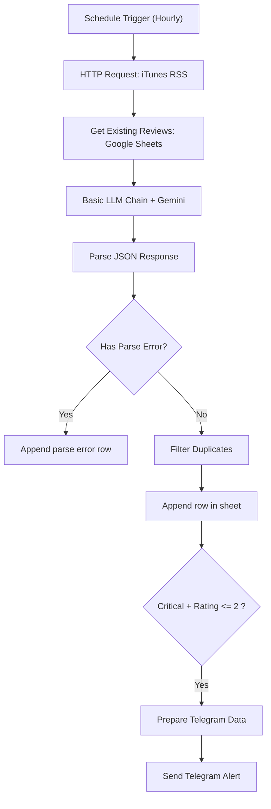

# VoC-Radar

iTunes App Store 리뷰를 주기적으로 수집해서, Gemini로 분류/요약하고 Google Sheets에 적재하며, `Critical + 저평점(<=2)` 조건일 때 Telegram으로 알림 보내는 n8n 워크플로우입니다.

---

## 핵심 흐름



---

## 현재 구현 기능

- **수집 주기**: 1시간 간격 스케줄
- **소스**: iTunes RSS (`limit=50`, `sortBy=mostRecent`)
- **AI 분석 결과**: `priority`, `category`, `summary`
- **중복 제거**: 기존 시트의 `ID` 기준 필터링
- **알림 조건**: `Critical` 우선순위 + `별점 <= 2`일 때만 Telegram 전송
- **실패 로그 경로**: JSON 파싱 실패 항목은 `Append parse error row` 노드로 시트에 적재

---

## 빠른 시작

### 1) 워크플로우 Import

- n8n → Workflows → Import from File
- `workflow.json` 업로드

### 2) Credential 연결

- Google Gemini
- Google Sheets OAuth2
- Telegram Bot

### 3) 노드 설정

- `HTTP Request`: 앱 ID/국가코드 필요 시 수정
- `Get Existing Reviews` / `Append row in sheet`: 문서 ID, 시트명 연결
- `Send Telegram Alert`: Chat ID 설정

### 4) 실행

- `Execute Workflow`로 테스트
- 검증 후 `Active` ON

---

## 중요: Import 후 꼭 확인할 항목

- 현재 버전은 스케줄 연결 키를 실제 노드명(`Schedule Trigger (Hourly Strategy)`)으로 맞춰둔 상태입니다.
- 그래도 n8n Import 환경에 따라 연결이 끊길 수 있으니, **Import 직후 Schedule → HTTP Request 연결**은 한 번 확인하세요.

---

## 주의사항 (현재 상태)

- HTTP Request 노드에 timeout/retry가 포함되어 있지만, 외부 API 상태에 따라 수집 누락이 발생할 수 있습니다.
- 파싱 오류는 별도 에러 row로 저장되므로, 운영 시 시트에서 `ID`가 `PARSE_ERROR_`로 시작하는 항목을 주기적으로 확인하세요.

---

## 파일 구조

```bash
├── workflow.json
├── assets/
└── README.md
```
