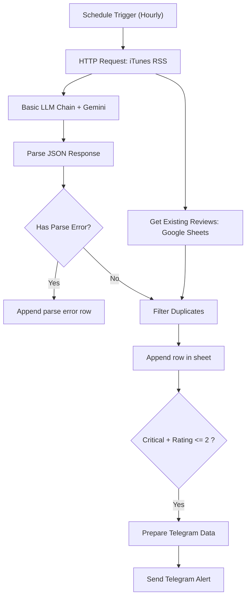

# VoC-Radar

iTunes App Store 리뷰를 주기적으로 수집해서, Gemini로 분류/요약하고 Google Sheets에 적재하며, `Critical + 저평점(<=2)` 조건일 때 Telegram으로 알림 보내는 n8n 워크플로우입니다.

> 기본 사례 데이터는 **당근 iOS 앱**(앱 ID: `1018769995`, 국가: `kr`) 기준으로 구성되어 있습니다.

---

## 핵심 흐름



---

## 현재 구현 기능

- **수집 주기**: 1시간 간격 스케줄
- **소스**: iTunes RSS (`limit=50`, `sortBy=mostRecent`)
- **AI 분석 결과**: `priority`, `category`, `summary`
- **중복 제거**: 기존 시트의 `ID` 기준 필터링
- **시트 초기화 자동화**: 빈 시트에서도 첫 실행 시 컬럼 자동 생성
- **알림 조건**: `Critical` 우선순위 + `별점 <= 2`일 때만 Telegram 전송
- **실패 로그 경로**: JSON 파싱 실패 항목은 `Append parse error row` 노드로 시트에 적재

---

## 빠른 시작 (처음 쓰는 사람 기준)

### 0) 준비물

- n8n 인스턴스 (Self-hosted/Cloud)
- Google Sheets 문서 1개 (빈 시트 가능)
- Google Gemini API Credential
- Telegram Bot Token + Chat ID

### 1) 워크플로우 Import

1. n8n → **Workflows** → **Import from File**
2. `workflow.json` 업로드

### 2) Credential 연결

아래 3개 Credential을 먼저 만들고 노드에 연결합니다.

- **Google Gemini(PaLM) Api**
- **Google Sheets OAuth2**
- **Telegram Bot**

### 3) Google Sheets 설정 (가장 자주 막히는 구간)

아래 3개 노드 모두 같은 문서를 바라보게 맞춰주세요.

- `Get Existing Reviews`
- `Append row in sheet`
- `Append parse error row`

권장 설정:

1. **Document = By URL**
2. 구글 시트 URL 전체 붙여넣기
   예: `https://docs.google.com/spreadsheets/d/문서ID/edit#gid=0`
3. **Sheet = By Name** → `Sheet1` (원하는 시트명으로 변경 가능)

> 참고: `By ID`는 목록 선택이 아니라 **문서 ID 직접 입력 모드**입니다.
> 아무것도 안 뜨는 게 정상일 수 있습니다.

### 4) Telegram 설정

`Send Telegram Alert` 노드에서 설정합니다.

1. Bot과 개인/그룹 채팅에서 먼저 `/start`
2. `https://api.telegram.org/bot<YOUR_BOT_TOKEN>/getUpdates` 호출
3. 응답 JSON의 `message.chat.id` 값을 `Chat ID`에 입력

`chat not found` 오류가 나면 대부분 Chat ID 불일치(또는 `/start` 미실행)입니다.

### 5) 실행

1. `Execute Workflow`로 수동 1회 테스트
2. Google Sheets에 row가 들어오는지 확인
3. 검증 완료 후 `Active` ON

### 6) 다른 App Store 앱으로 바꾸는 방법

1. 바꾸려는 앱의 **앱 ID**를 확인합니다.
   - App Store URL에서 확인: `.../id123456789` 형태의 숫자
   - 또는 Lookup API 사용: `https://itunes.apple.com/lookup?bundleId=<BUNDLE_ID>&country=<COUNTRY>`
2. `HTTP Request` 노드 URL을 아래 형식으로 수정합니다.
   - `https://itunes.apple.com/{country}/rss/customerreviews/limit=50/id={appId}/sortBy=mostRecent/json`
3. 앱을 바꿀 때는 시트 분리를 권장합니다.
   - `Sheet1` 대신 앱별 탭(예: `Daangn`, `MyTargetApp`)을 만들고
   - `Get Existing Reviews` / `Append row in sheet` / `Append parse error row`의 `Sheet`를 동일하게 맞춥니다.

---

## 중요: Import 후 꼭 확인할 항목

- 현재 버전은 스케줄 연결 키를 실제 노드명(`Schedule Trigger (Hourly Strategy)`)으로 맞춰둔 상태입니다.
- 그래도 n8n Import 환경에 따라 연결이 끊길 수 있으니, **Import 직후 Schedule → HTTP Request 연결**은 한 번 확인하세요.

---

## 주의사항 (현재 상태)

- HTTP Request 노드에 timeout/retry가 포함되어 있지만, 외부 API 상태에 따라 수집 누락이 발생할 수 있습니다.
- 파싱 오류는 별도 에러 row로 저장되므로, 운영 시 시트에서 `ID`가 `PARSE_ERROR_`로 시작하는 항목을 주기적으로 확인하세요.

---

## 실행 결과 해석 가이드

- `Get Existing Reviews`가 0건이어도 정상입니다. (첫 실행/빈 시트)
- `Append row in sheet`가 실행되면 신규 리뷰 저장 성공입니다.
- Telegram은 **Critical + 별점 <= 2** 조건일 때만 옵니다.
  (알림이 안 와도 저장은 정상일 수 있음)

---

## 트러블슈팅

| 증상 | 원인 | 해결 |
| --- | --- | --- |
| Google Sheets에서 `By ID` 눌렀는데 목록이 안 보임 | `By ID`는 목록 모드가 아님 | 문서 ID를 직접 입력하거나 `By URL` 사용 |
| `Bad Request: chat not found` | Chat ID 오입력 / 봇 대화 시작 안 함 | `/start` 후 `getUpdates`로 chat.id 재확인 |
| `No valid data parsed`가 저장됨 | LLM 응답이 JSON 파싱 실패 | Parse error row 원문 확인 후 프롬프트/모델 응답 점검 |
| 실행은 되는데 신규 row가 없음 | 모두 중복 ID이거나 신규 리뷰 없음 | `Filter Duplicates` 출력 item 수 확인 |

---

## 파일 구조

```bash
├── workflow.json
├── assets/
└── README.md
```
