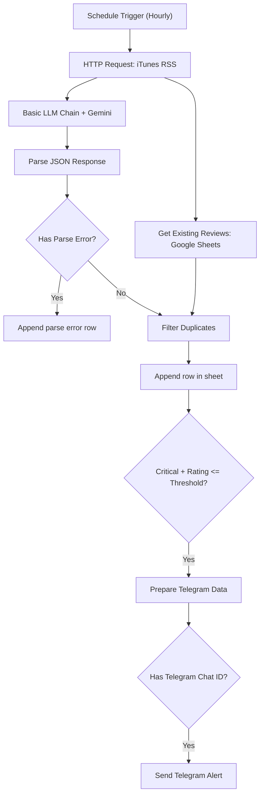

# VoC-Radar

iTunes App Store 리뷰를 주기적으로 수집하고, Gemini로 분류/요약한 뒤 Google Sheets에 저장합니다.
또한 **`Critical + 저평점`** 조건을 만족하면 Telegram으로 즉시 알림을 보냅니다.

> 기본 예시는 **당근 iOS 앱**(App ID: `1018769995`, 국가: `kr`) 기준입니다.

---

## 아키텍처 한눈에 보기


```mermaid
graph TD
    A["Schedule Trigger (Hourly)"] --> B["HTTP Request: iTunes RSS"]
    B --> C["Get Existing Reviews: Google Sheets"]
    B --> D["Basic LLM Chain + Gemini"]
    D --> E["Parse JSON Response"]
    E --> F{"Has Parse Error?"}
    F -->|"Yes"| G["Append parse error row"]
    F -->|"No"| H["Filter Duplicates"]
    C --> H
    H --> I["Append row in sheet"]
    I --> J{"Critical + Rating <= Threshold?"}
    J -->|"Yes"| K["Prepare Telegram Data"]
    K --> M{"Has Telegram Chat ID?"}
    M -->|"Yes"| L["Send Telegram Alert"]
```

---

## 주요 기능

- **수집 주기**: 1시간 간격 스케줄
- **소스**: iTunes RSS (`limit=50`, `sortBy=mostRecent`)
- **분석**: Gemini 기반 `priority / category / summary` 생성
- **안정성**: HTTP + LLM 재시도(최대 3회)
- **중복 제거**: 기존 시트 ID + 현재 배치 ID 중복 모두 제거
- **시트 초기화 대응**: 빈 시트에서도 첫 실행 가능
- **알림 기본값 OFF**: `TELEGRAM_CHAT_ID` 미설정 시 Telegram 자동 스킵
- **운영 가시성**: 파싱 실패는 `PARSE_ERROR_` row로 별도 저장

---

## 빠른 시작

### 0) 준비물

- n8n 인스턴스 (Self-hosted 또는 Cloud)
- Google Sheets 문서 1개
- Google Gemini API Credential
- Telegram Bot Token + Chat ID

### 1) 워크플로우 Import

1. n8n → **Workflows** → **Import from File**
2. `workflow.json` 업로드

### 2) Credential 연결

아래 Credential을 생성 후 노드에 연결합니다.

- **Google Gemini(PaLM) Api**
- **Google Sheets OAuth2**
- **Telegram Bot**

### 3) 환경변수 설정 (권장)

| 변수명 | 설명 | 기본값 |
| --- | --- | --- |
| `VOC_SHEET_ID` | Google Spreadsheet ID | 없음 (직접 입력 필요) |
| `VOC_SHEET_NAME` | 시트명 | `Sheet1` |
| `TELEGRAM_CHAT_ID` | Telegram Chat ID | 미설정 시 알림 OFF |
| `VOC_ALERT_MAX_RATING` | 알림 별점 상한 (1~5) | `2` |

> 환경변수를 쓰기 어렵다면 노드에서 직접 입력해도 동작합니다.

### 4) Google Sheets 노드 맞추기

아래 3개 노드가 **같은 문서/시트**를 바라보게 설정합니다.

- `Get Existing Reviews`
- `Append row in sheet`
- `Append parse error row`

권장 방식:

1. **Document = By URL**
2. 구글 시트 URL 전체 입력
3. **Sheet = By Name**로 시트명 지정

> `By ID`는 목록 선택이 아니라 **문서 ID 직접 입력 모드**입니다.

### 5) Telegram 설정

`Send Telegram Alert` 노드 기준:

1. 봇과 개인/그룹 채팅에서 `/start`
2. `https://api.telegram.org/bot<YOUR_BOT_TOKEN>/getUpdates` 호출
3. 응답 JSON의 `message.chat.id` 값을 `TELEGRAM_CHAT_ID`로 설정

`chat not found`는 대부분 Chat ID 불일치 또는 `/start` 미실행입니다.

---

## 원하는 알림 별점 설정법 (핵심)

### 방법 A) 권장: 환경변수로 제어

`VOC_ALERT_MAX_RATING` 값을 바꾸면 됩니다.

- `1` → 1점 리뷰만 알림
- `2` → 1~2점 알림 (기본)
- `3` → 1~3점 알림

예) 3점 이하를 알림으로 받고 싶다면:

```bash
VOC_ALERT_MAX_RATING=3
```

### 방법 B) 노드식 직접 수정

`Check Critical Priority` 노드의 조건식에서 숫자 임계값(상한)을 직접 수정해도 됩니다.

> 현재 우선순위 조건은 `Critical` 고정입니다.
> `High`까지 포함하려면 같은 노드의 조건식에서 `priority` 판단 로직을 함께 수정하세요.

---

## 다른 App Store 앱으로 바꾸기

1. 대상 앱의 App ID 확인 (`.../id123456789` 형태)
2. `HTTP Request` 노드 URL 수정
   - `https://itunes.apple.com/{country}/rss/customerreviews/limit=50/id={appId}/sortBy=mostRecent/json`
3. 앱별 시트 분리를 권장
   - 예: `Daangn`, `MyTargetApp` 탭을 분리해서 운영

---

## 운영 체크리스트

- Import 직후 **Schedule → HTTP Request 연결** 확인
- 수동 `Execute Workflow` 1회로 초기 검증
- Google Sheets 저장 여부 확인
- Telegram은 조건 충족 시에만 발송되는지 확인
- `PARSE_ERROR_` row를 주기적으로 점검

---

## 트러블슈팅

| 증상 | 원인 | 해결 |
| --- | --- | --- |
| `By ID`에서 문서 목록이 안 보임 | `By ID`는 목록 모드가 아님 | 문서 ID 직접 입력 또는 `By URL` 사용 |
| Telegram 알림이 안 감 | Chat ID 미설정 또는 조건 미충족 | `TELEGRAM_CHAT_ID` / `VOC_ALERT_MAX_RATING` / 조건 데이터를 점검 |
| `Bad Request: chat not found` | Chat ID 오류 또는 `/start` 미실행 | `/start` 실행 후 `getUpdates`로 `chat.id` 재확인 |
| `No valid data parsed` 저장됨 | LLM 응답 JSON 파싱 실패 | `Append parse error row`의 원문 확인 후 프롬프트/모델 응답 점검 |
| 실행되는데 신규 row가 없음 | 신규 리뷰 없음 또는 전부 중복 | `Filter Duplicates` 출력 item 수 확인 |

---

## 파일 구조

```bash
├── workflow.json
└── README.md
```
