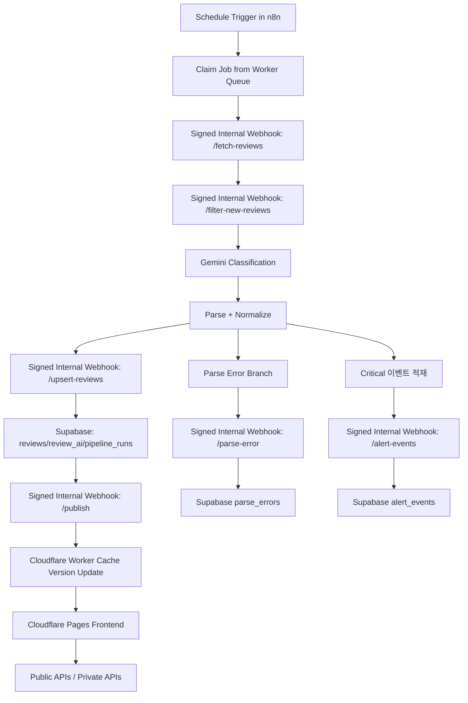

# VoC-Radar

VoC-Radar는 App Store 리뷰 VoC 파이프라인을 **n8n 오케스트레이션 유지** 상태로,
**Supabase 저장소 + Cloudflare Worker BFF + Cloudflare Pages 프론트엔드**로 확장한 프로젝트입니다.

## 아키텍처


```mermaid
graph TD
    A[Schedule Trigger in n8n] --> B[Claim Job from Worker Queue]
    B --> C[Signed Internal Webhook: /fetch-reviews]
    C --> D[Signed Internal Webhook: /filter-new-reviews]
    D --> E[Gemini Classification]
    E --> F[Parse + Normalize]
    F --> G[Signed Internal Webhook: /upsert-reviews]
    G --> H[Supabase: reviews/review_ai/pipeline_runs]
    H --> I[Signed Internal Webhook: /publish]
    I --> J[Cloudflare Worker Cache Version Update]
    J --> K[Cloudflare Pages Frontend]
    K --> L[Public APIs / Private APIs]
    F --> M[Parse Error Branch]
    M --> N[Signed Internal Webhook: /parse-error]
    N --> O[Supabase parse_errors]
    F --> P[Critical 이벤트 적재]
    P --> Q[Signed Internal Webhook: /alert-events]
    Q --> R[Supabase alert_events]
```

---

## 구성 요소

- `n8n/workflow.supabase-only.json`: 단일 운영 워크플로우 (요청 큐 + 최대 500개 리뷰 수집)
- `apps/worker`: Cloudflare Worker(BFF + internal webhook)
- `apps/web`: Cloudflare Pages용 React 리포트 사이트
- `supabase/migrations`: 스키마/RLS/함수 마이그레이션

---

## 빠른 시작

## 1) 의존성 설치

```bash
npm install
```

## 2) Supabase 마이그레이션 적용

> Supabase CLI 또는 SQL Editor에서 `supabase/migrations/202602250001_voc_radar_init.sql` 적용
> 그리고 `supabase/migrations/202602270001_pipeline_jobs.sql`, `supabase/migrations/202602270002_review_prefilter.sql`, `supabase/migrations/202603010001_pipeline_jobs_function_fix.sql` 순서로 추가 적용

핵심 테이블:

- `apps`
- `reviews`
- `review_ai`
- `pipeline_runs`
- `parse_errors`
- `alert_events`

핵심 함수:

- `get_public_overview`
- `get_public_trends`
- `get_public_categories`

## 3) Worker 환경변수 설정

`apps/worker/.dev.vars` (로컬) 또는 Cloudflare Dashboard Secrets 설정:

```bash
SUPABASE_URL=https://<your-project>.supabase.co
SUPABASE_SERVICE_ROLE_KEY=<service-role-key>
SUPABASE_ANON_KEY=<anon-key>
PIPELINE_WEBHOOK_SECRET=<strong-secret>
DETAIL_VIEW_ENABLED=true
API_TIMEOUT_MS=10000
API_RETRY_COUNT=2
CORS_ORIGIN=http://localhost:5173
```

## 4) Web 환경변수 설정

`apps/web/.env.local`:

```bash
VITE_API_BASE_URL=http://127.0.0.1:8787
VITE_SUPABASE_URL=https://<your-project>.supabase.co
VITE_SUPABASE_ANON_KEY=<anon-key>
VITE_DEFAULT_APP_ID=1018769995 # optional fallback
VITE_DEFAULT_COUNTRY=kr        # optional fallback
VITE_API_TIMEOUT_MS=10000
VITE_API_RETRY_COUNT=2
```

## 5) 로컬 실행

```bash
# 터미널 1
npm run dev:worker

# 터미널 2
npm run dev:web
```

---

## n8n 설정 (v2)

n8n import 파일 선택:

- `n8n/workflow.supabase-only.json` (단일 운영본)

import 후 아래 환경변수 사용:

| 변수 | 설명 |
|---|---|
| `VOC_BFF_BASE_URL` | Worker API base URL (예: `https://voc-radar-api.<subdomain>.workers.dev`) |
| `PIPELINE_WEBHOOK_SECRET` | 내부 webhook HMAC secret |
| `VOC_APP_ID` | App Store 앱 ID |
| `VOC_APP_COUNTRY` | 국가 코드 (`kr` 등) |
| `VOC_APP_NAME` | 앱 표시명 |
| `VOC_ALLOW_FALLBACK` | `true`면 큐 비어도 fallback 앱 수집, 기본 `false` |
| `VOC_FETCH_LIMIT` | 요청당 수집 최대 개수(기본/최대 500) |
| `VOC_MODEL_VERSION` | 모델 버전 라벨 |
| `VOC_ALERT_MAX_RATING` | 알림 평점 상한 |

> v2.1부터는 `Analyze` 화면에서 앱/국가를 요청 큐로 등록할 수 있어, 고정값(`VOC_APP_*`)은 fallback 용도로만 사용 가능합니다.

---

## API 요약

### Public

- `GET /api/health`
- `GET /api/public/apps?limit`
- `GET /api/public/overview?appId&country&from&to`
- `GET /api/public/trends?appId&country&from&to`
- `GET /api/public/categories?appId&country&from&to`

### Private (Auth 필수)

- `GET /api/private/reviews?appId&country&cursor&limit`
- `GET /api/private/jobs?limit`
- `POST /api/private/jobs`

### Internal (n8n 전용, HMAC 서명 필수)

- `POST /api/internal/pipeline/claim-job`
- `POST /api/internal/pipeline/fetch-reviews`
- `POST /api/internal/pipeline/job-status`
- `POST /api/internal/pipeline/filter-new-reviews`
- `POST /api/internal/pipeline/upsert-reviews`
- `POST /api/internal/pipeline/parse-error`
- `POST /api/internal/pipeline/publish`
- `POST /api/internal/pipeline/alert-events`

---

## 보안/운영 기본값

- 상세뷰 kill-switch: `DETAIL_VIEW_ENABLED=false`
- 내부 API는 `x-voc-timestamp` + `x-voc-signature`(HMAC SHA-256) 검증
- 외부 호출(Supabase/Auth)은 timeout + retry(멱등성 고려) 적용
- n8n은 LLM 호출 전 `filter-new-reviews`를 통해 이미 처리된 review_id를 제거
- Telegram 노드는 제거되어 외부 메신저 연동 없이 동작

---

## 검증 명령

```bash
npm run typecheck
npm run build
./scripts/smoke-worker.sh
```

운영 배포 절차는 `docs/deployment-runbook.md`를 참고하세요.

---

## IDEAHUB 패턴 반영 (pattern_only)

- `layout-split-hero`
- `layout-section-storytelling`
- `typography-kinetic-headline`

Provenance examples:

- https://github.com/Animmaster/AidEasy
- https://github.com/Animmaster/Obys-clone
- https://github.com/Animmaster/StreamVibe
