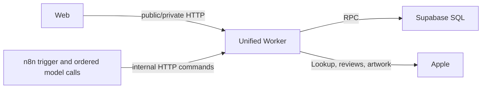

# VoC Radar 아키텍처

## 책임 경계

| 구성요소 | 소유하는 계약 | 소유하지 않는 계약 |
| --- | --- | --- |
| Web | 공개 성공 DTO runtime decode, request cancellation, resource state, Worker가 반환한 report window 재사용 | report 기간 계산, Apple retry/cache, persisted priority |
| Worker | public/private/internal HTTP, Apple I/O, 입력 정규화, persisted priority, payload 제한, raw-body internal 인증 | job의 durable 상태 전이, lease 복구, model call 순서 |
| n8n | webhook·poll trigger, claim 명령, 모델 batch의 순차 실행, node retry, checkpoint·heartbeat orchestration | Apple page I/O, durable job 상태, atomic publish |
| SQL | job 상태·stage, claim token, lease, attempt, staging, fencing, snapshot/membership 저장, atomic publish | HTTP 인증, Apple 호출, model invocation |



이 구분에서 n8n은 흐름을 실행하지만 데이터·I/O 계약의 최종 소유자는 아닙니다. Worker는 Apple 응답과 n8n payload를 canonical 형태로 바꾸고, SQL은 유효한 claim 안에서만 durable state를 바꾸고 게시합니다.

## 공개 read path

`GET /api/public/report`는 다음 envelope를 canonical 성공 DTO로 반환합니다.

```text
data
  window: { from, to }
  app
  summary
  analysis
  issues
  categories
  trends
```

범위를 생략하면 Worker가 다음 UTC 자정 1밀리초 전까지의 최근 30개 UTC 날짜를 정하고 `data.window`에 확정값을 반환합니다. Web은 이 값을 runtime decode한 뒤 issue detail과 review 요청의 `from`·`to`에 그대로 전달합니다. `REPORT_V2_ENABLED=true`인 정상 경로에서는 report, issue, review가 이 기간을 공유하며 별도 클라이언트 기간 계산을 사용하지 않습니다. `false`는 DB 전환 전용 rollback 호환 경로라서 overview·category·trend와 review는 `data.window`를 사용하지만 legacy issue list/detail RPC는 기간 인자를 지원하지 않습니다. 이 모드의 이슈 수치는 기간 정합성을 보장하지 않는 임시 호환 결과입니다.

V2 이슈 집계는 기간 안의 각 리뷰에 대해 가장 최근 `published + passed` run의 membership 하나를 사용합니다. 제목·severity·요약은 cluster의 최신 유효 snapshot을 사용하고, 상세 응답의 `reviewCount`·`evidenceCount`는 전체 근거 수를, `reviews`는 대표·최신 근거 우선 최대 50건을 나타냅니다.

아트워크 복구는 세 단계뿐입니다.

1. report/discovery metadata의 신뢰된 `artworkUrl`을 직접 로드합니다.
2. 직접 로드가 실패하거나 URL이 없으면 canonical `/api/public/artwork?appId&country`를 한 번 호출합니다.
3. proxy도 실패하면 Web의 로컬 fallback을 표시합니다.

Worker proxy가 Apple metadata·image upstream retry, MIME/512KiB 제한, cache key와 TTL을 소유합니다. Web은 `attempt`나 cache revision query로 동일 proxy를 중복 호출하지 않습니다.

## 분석 write path

```mermaid
flowchart LR
  Trigger["Webhook or 5-minute poll"] --> Claim["Worker claim command"]
  Claim --> Fetch["Worker Apple fetch and normalization"]
  Fetch --> Extract["n8n ordered extraction batches"]
  Extract --> Cluster["n8n ordered clustering and consolidation"]
  Cluster --> Boundary["Worker validation and payload boundary"]
  Boundary --> Stage["SQL private staging and fencing"]
  Stage --> Publish["SQL atomic publish"]
```



1. n8n의 `$execution.id`를 `claim_key`로 Worker에 보냅니다. SQL은 같은 key의 재요청에 같은 job·claim token을 반환하며 다른 job을 가져가지 않습니다.
2. SQL은 claim할 때 `status='running'`, `stage='fetching'`, 15분 lease, 증가된 `attempt_count`를 원자적으로 기록합니다.
3. Worker가 Apple review page를 수집하고 review ID·앱·국가·필드를 정규화합니다. 기간 범위가 완전하지 않으면 `review_scope_incomplete`로 부분 결과를 차단합니다.
4. n8n은 extraction, clustering, consolidation model batch를 각각 순차 실행합니다. 각 결과는 checkpoint 뒤 동일 claim의 heartbeat가 성공해야 다음 단계로 진행됩니다.
5. Worker는 canonical cluster contract, claim, app scope, payload 상한을 검증하고 SQL RPC를 호출합니다.
6. SQL은 review AI staging, cluster identity/snapshot/membership, publish pointer와 job completion을 fence가 있는 transaction으로 처리합니다. 취소되거나 lease를 잃은 실행은 게시할 수 없습니다.

`pipeline_jobs.status`는 `queued → running → completed | failed | canceled`만 허용합니다. `pipeline_jobs.stage`는 `queued → fetching → extracting → clustering → publishing` 순서로만 전진합니다. 같은 stage heartbeat는 lease만 갱신할 수 있고 지연된 이전 stage는 상태를 되돌릴 수 없습니다.

## 두 단계 재시도와 복구

n8n call retry와 SQL execution recovery는 별도 계층입니다.

- n8n: transient call을 해당 node 안에서 `retryOnFail=true`, `maxTries=3`으로 재시도합니다. extraction·clustering·consolidation model node도 같은 node-level 한도를 사용합니다.
- SQL: `attempt_count < 3`인 queued job만 claim합니다. 15분 lease가 만료된 `running` job은 이전 staging을 정리하고 다시 queue에 넣으며, 세 번째 실행 시도의 lease가 만료되면 `failed`로 종결합니다.

같은 논리적 model batch가 한 execution attempt에서 세 번 호출되고, 그 execution이 checkpoint 전에 끝나 세 번의 DB attempt 모두 같은 지점까지 진행하는 조건에서는 최대 9회 호출이 가능합니다. 이는 두 기존 값 `3 × 3`을 조합한 조건부 최악의 경우 추론입니다. 실제 수는 어느 call에서 실패했는지, 응답이 checkpoint됐는지, heartbeat가 성공했는지에 따라 줄어듭니다.

Worker의 개별 Apple review page fetch는 5초 timeout, manual redirect, retry 0회입니다. 상위 n8n `fetch-reviews` HTTP node나 SQL attempt가 다시 실행될 수 있다는 사실은 Apple page 자체의 retry 횟수를 바꾸지 않습니다.

n8n terminal failure가 Worker의 completion/failure command에 도달하지 못하면 job은 마지막 heartbeat 기준 `running`으로 남습니다. 15분 lease가 막 만료될 때까지 기다리고 5분 polling 주기의 다음 tick도 놓치는 조건에서는 recovery가 약 20분 뒤 시작될 수 있습니다. 이 값은 두 스케줄 경계에서 계산한 운영 추론이며 SLA가 아닙니다.

## Canonical 계약과 생성 방향

### Cluster contract

`contracts/cluster-contract.mjs`가 enum, 문자열 길이, 최대 10,000 review 입력, 대표 review ID 최대 3개, 정확히 한 번 배정의 유일한 authoritative source입니다. Worker와 Node entry는 adapter/re-export이고, packer는 같은 상수를 독립 런타임인 n8n adapter source에 주입합니다. `contracts/cluster-contract.fixtures.mjs`의 동일 fixture corpus가 모든 실행 경계를 비교합니다.

### Workflow

`n8n/workflow.template.json`은 graph, node ID, 연결, timeout과 portable metadata의 원본입니다. `n8n/code/*.js`는 Code-node body의 원본입니다. `scripts/build-workflow-v2.mjs`가 두 입력을 한 방향으로 pack해 `n8n/workflow.supabase-only.json`을 만듭니다. 생성 artifact를 직접 수정하거나 artifact를 다시 입력으로 읽어 patch하지 않습니다.

```bash
node scripts/build-workflow-v2.mjs
node scripts/build-workflow-v2.mjs --check
npm run verify:workflow
```

### Supabase schema

적용된 migration은 변경하지 않는 upgrade 이력입니다. `scripts/generate-supabase-schema.mjs`는 PostgreSQL 17의 빈 격리 DB에 migration 전체를 파일명 순서로 재생하고 최종 `public` catalog를 dump해 `supabase/schema.sql`을 생성합니다. 따라서 `schema.sql`에는 과거 backfill 단계와 superseded 함수 body가 아니라 새 설치에 필요한 최종 객체만 있어야 합니다.

`scripts/verify-postgres-runtime.mjs`는 한 임시 컨테이너의 서로 격리된 두 DB를 검사합니다.

- `fresh_path`: 생성된 `supabase/schema.sql`만 적용
- `upgrade_path`: 모든 migration을 순서대로 적용

Verifier는 function, relation, constraint, index, RLS/policy, grant, view/trigger catalog를 비교하고 양쪽에 같은 semantic fixture를 실행합니다.

## 인증 경계

Public, private, internal 정책은 합치지 않습니다.

- private route는 Supabase access token을 검증합니다.
- Worker는 알려진 internal POST route를 먼저 resolve한 뒤 raw body를 한 번 읽습니다. `x-voc-token` 또는 지원되는 HMAC을 `PIPELINE_WEBHOOK_SECRET`으로 한 번 검증하고, branded authenticated context만 handler에 전달합니다.
- 알 수 없는 internal path는 404이고 알려진 path의 인증 실패는 401입니다. Handler가 raw request를 다시 읽거나 인증을 반복하지 않습니다.
- webhook trigger는 별도의 `N8N_PIPELINE_TRIGGER_SECRET`을 Worker와 n8n에 모두 요구합니다. n8n은 `Validate Trigger Secret` 단계에서 claim 전에 거부합니다.

두 secret은 tracked workflow·문서·execution item에 값을 남기지 않습니다.

n8n Code node는 같은 버전의 별도 `n8nio/runners` container에서 실행합니다. n8n task broker와 runner는 host에 publish되지 않은 Compose network에서 `N8N_RUNNERS_AUTH_TOKEN`으로 서로 인증합니다. 현재 workflow는 `VOC_*` 설정과 webhook trigger secret을 `$env`로 읽으므로 `N8N_BLOCK_ENV_ACCESS_IN_NODE=false`를 유지하며, n8n 편집 권한을 신뢰된 운영자로 제한합니다.

## Compatibility 보존

`/api/internal/pipeline/job-status`와 기존 public compatibility route는 정적 코드 검색 결과만으로 제거하지 않습니다. `REPORT_V2_ENABLED=false`가 사용하는 latest-run read RPC도 rollback 경로로 유지합니다. 다음 조건을 모두 증명한 별도 변경에서만 퇴역시킵니다.

- production access·workflow evidence에서 caller가 없습니다.
- 현재 Web과 n8n artifact가 대체 경로만 사용합니다.
- rollback 보존 기간이 끝났습니다.
- 제거 후 반대 feature-flag 모드와 public/private 권한 검증이 통과합니다.

## 장애 시 보존되는 데이터

모델·cluster validation·persistence·publish가 실패해도 `published + passed` pointer는 바뀌지 않습니다. 실패한 run의 staging은 lease recovery 또는 terminal 처리에서 정리되며, 이전 공개 report는 계속 제공됩니다. Additive DB 객체와 migration ledger는 일반 코드 rollback에서 삭제하지 않습니다.
