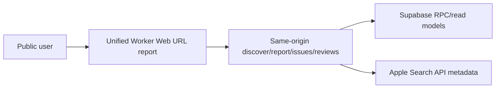

# VoC Radar 아키텍처

## 시스템 역할

- **Unified Worker**: Vite Web 정적 자산과 public/private/internal API를 같은 origin에서 제공합니다. 얇은 entry가 세 route 모듈을 dispatch하고, platform 모듈이 인증·Supabase 호출·오류 envelope·캐시 경계를 공유합니다.
- **Supabase**: Auth, 원문 리뷰, 실행 상태, issue identity/snapshot/membership을 저장합니다.
- **n8n**: queue claim, App Store 수집, 두 단계 AI 처리, 내부 API 호출을 담당합니다.

## 공개 read path

`/api/public/report`는 앱 메타, overview, category/trend, issue cluster를 하나의 canonical 응답으로 합치며 모든 집계와 issue membership에 같은 inclusive `from`/`to` 범위를 적용합니다. 범위를 생략하면 Web과 동일하게 다음 UTC 자정 1밀리초 전까지의 최근 30개 UTC 날짜를 사용합니다. 이슈 집계는 범위 안의 리뷰마다 가장 최근 `published + passed` run의 membership 하나만 채택합니다. 따라서 증분 run에 없는 이전 리뷰는 유지되고, 이후 재분석에서 다른 cluster로 이동한 리뷰는 이전 분류에서 빠집니다. 제목·심각도·요약은 해당 cluster의 가장 최근 유효 snapshot을 사용하며, 범위 집계에는 snapshot 전체의 변화율을 섞지 않습니다. 상세 응답의 `reviewCount`와 `evidenceCount`는 전체 근거 수이고, `reviews` 원문 배열은 대표 근거와 최신 근거 우선 최대 50개입니다.

`/api/public/apps`는 앱·국가별 최신 `published` run 중 review가 있는 행만 선택하고 `apps` 메타와 정확한 복합 키로 결합해 한 service-role RPC에서 최대 100건을 반환합니다. 앱별 DB fan-out 없이 최근순과 고유성을 SQL에서 확정합니다. `DETAIL_VIEW_ENABLED=false`이면 원문을 포함하는 issue detail, legacy dashboard, 공개·로그인 review feed는 cache나 DB 조회 전에 HTTP 403으로 닫히며 overview와 issue 목록은 유지됩니다.

## 분석 write path

```mermaid
flowchart LR
  R["Authenticated request"] --> J["One active job per app/country"]
  J --> Q["Idempotent claim + 15 minute lease"]
  Q --> F["Fetch reviews"]
  F --> E["Stage 1: per-review extraction"]
  E --> C["Stage 2: existing match/new clustering"]
  C --> V["Exact-ID and enum validation"]
  V --> P["Atomic snapshots + memberships"]
  P --> B["Atomic publish + job completion"]
```

- `pipeline_jobs.status`: `queued → running → completed | failed | canceled`
- `pipeline_jobs.stage`: `queued → fetching → extracting → clustering → publishing`
- n8n의 `$execution.id`가 `claim_key`이며 같은 key 재시도는 기존 job과 token을 반환합니다. claim lease는 15분이고 최대 시도는 3회입니다.
- 만료된 `running` 작업만 `queued`로 회수합니다. 세 번째 시도가 만료되면 `failed`로 종결하며 terminal 상태와 claim identity는 바꾸지 않습니다.
- claim 이후의 모든 내부 요청은 `jobId + claimToken + runId`를 전달합니다. 데이터 변경 RPC는 claim 검증과 쓰기를 같은 transaction에서 수행하므로 취소되거나 lease를 잃은 실행은 `409 job_claim_lost` 이후 상태나 데이터를 되살릴 수 없습니다. Heartbeat는 같은 stage 또는 이후 stage만 허용해 지연 응답이 상태를 되돌리지 못합니다.
- Stage 1과 Stage 2의 모델 호출은 각각 최대 50개와 40개 리뷰 단위로 직렬 실행합니다. 각 모델 응답은 실행 checkpoint에 보관한 뒤 같은 `jobId + claimToken + runId`의 heartbeat가 성공해야 검증 단계로 전달하므로, 여러 배치의 누적 실행 시간이 15분을 넘어도 lease를 유지합니다. 단일 모델 호출이 lease를 넘기면 직후 heartbeat가 결과를 폐기하고 해당 시도는 재시도 대상으로 남습니다.
- 최근 성공 publish 후 24시간 이내 요청은 `fresh` 결과와 다음 허용 시각을 반환합니다.
- Web에서 생성하는 새 작업은 사용자별 최근 24시간 rolling quota를 적용합니다. 기본 한도는 10건이며 1~100 범위에서 설정합니다. `fresh`와 `existing` 응답은 새 작업을 만들지 않으므로 quota를 소비하지 않고, 이미 생성된 Web 작업은 이후 실패·취소돼도 해당 24시간 집계에 포함됩니다.
- 동일 앱·국가의 active job은 partial unique index와 원자적 enqueue RPC로 하나만 허용합니다. 사용자 quota count와 insert는 사용자 advisory lock 안에서 실행하므로 서로 다른 앱을 동시에 요청해도 한도를 우회할 수 없습니다.
- Apple Lookup 직전에는 인증 사용자 UUID를 key로 하는 Cloudflare rate limiter를 적용합니다. 60초에 10회인 이 경계는 존재하지 않는 숫자 ID 반복 요청의 외부 호출을 줄이며, 전역 정산용 quota가 아니라 Cloudflare PoP 단위의 단기 남용 방어입니다. limiter binding이 없거나 응답하지 않으면 Apple을 호출하지 않고 요청을 거부합니다.
- App Store 수집은 기본 최근 30일, 최대 40페이지 뒤 terminal probe 1회로 범위 완전성을 확인합니다. 각 Apple 요청은 5초, Worker 전체 수집은 270초, n8n 호출은 300초로 제한합니다. 기간 안 리뷰가 더 남거나 입력 상한에 도달하면 `review_scope_incomplete`로 실패시키고 staging·공개 snapshot을 바꾸지 않습니다.
- review 원문·extraction은 run별 비공개 staging에 묶이고, cluster identity·snapshot·membership 저장과 publish pointer·job 완료는 각 경계에서 transaction RPC로 원자적으로 처리합니다.
- 파이프라인은 review scope를 최대 10,000개 ID의 단일 JSONB 값으로 조회해 PostgREST 행 제한과 긴 query URL을 피합니다. Review·cluster persistence도 10,000개 입력 상한을 Worker와 DB에서 함께 검사하며, 두 transaction RPC에만 60초 timeout을 사용합니다.
- 신규 raw review는 cluster membership FK를 위해 먼저 생성될 수 있지만 committed `review_ai`와 결합되기 전에는 공개 read model에 나타나지 않습니다. Publish transaction이 staged raw와 AI를 함께 병합하며 실패·취소·lease 만료 시 staging을 제거합니다.
- 새 title/category/model/last occurrence는 run snapshot에 staging되고, `pipeline_runs.validation_status='passed'`인 run만 publish됩니다. 실패하거나 미게시된 run은 기존 공개 metadata와 pointer를 바꾸지 않습니다.
- 클러스터링은 기본 30개, 최대 40개 리뷰 단위로 1차 검증합니다. 각 배치는 최신 유효 cluster identity 최대 10,000개 중 카테고리, 한글·영문·숫자 어휘, review count, 최근 발생 시각을 기준으로 최대 160개·49,152 UTF-8 bytes만 선택합니다. Consolidation은 최대 48개 후보와 65,536 UTF-8 bytes prompt 단위로 직렬 실행하며, 후보와 전체 리뷰가 각각 정확히 1회 배정됐는지 publish 전에 전역 재검증합니다. 같은 canonical identity는 전역 병합되지만 서로 다른 key의 의미상 중복이 서로 다른 consolidation batch에 있으면 별도 이슈로 남을 수 있습니다.
- 운영 재분석 작업은 `pipeline_jobs.source='reanalysis'`로만 표시합니다. 이 경우 이미 저장된 리뷰도 extraction 입력으로 되돌리되, 일반 사용자의 24시간 cooldown 계약은 변경하지 않습니다. 같은 리뷰를 새 분류 계약으로 다시 해석한 run은 시계열 비교 대상이 아니므로 `changePercent`를 `null`로 저장합니다.
- 운영 n8n은 production concurrency를 1로 제한하고 webhook 누락 job을 5분마다 polling합니다. 따라서 긴 실행 중 새 실행이 무한 병렬화되지 않으며, webhook 장애 시 queue 회수는 다음 polling까지 최대 약 5분 지연될 수 있습니다.
- 계정 삭제 준비 RPC는 사용자별 enqueue advisory lock 안에서 active job 취소와 모든 해당 job 메모 삭제를 원자적으로 수행합니다. 뒤이은 Auth 삭제가 `requested_by`를 null로 바꾸는 동안 생성된 Web job도 외래 키 trigger가 메모를 함께 지웁니다. Auth 삭제 결과가 확인되지 않으면 계정은 남아 있을 수 있으므로 Web은 로그인 상태 확인과 재시도를 안내합니다.
- 공개 이슈 목록·상세는 기본 30일, 최대 90일의 지정 기간에서 여러 `published + passed` run을 합치되 리뷰별 최신 membership만 사용합니다. 상세 원문은 50개로 제한하고 전체 evidence 수와 이슈 목록의 제한 전 총계는 별도로 보존합니다. 다음 실행의 cluster context는 앱·국가에 속한 각 cluster의 전체 게시 이력에서 최신 유효 snapshot을 하나씩 사용합니다. 증분 run이 건드리지 않은 identity도 유지하고 전체 identity가 10,000개를 넘으면 일부를 숨기지 않고 작업을 명시적으로 실패시킵니다.

## 데이터 모델

- `issue_clusters`: 앱·국가별 stable identity와 canonical key
- `issue_cluster_snapshots`: run별 canonical severity, 집계, 비교값, validation result
- `issue_cluster_reviews`: `(run_id, review_id)` primary key로 한 run에서 하나의 주 이슈만 허용
- `pipeline_review_ai_staging`: publish 전 run별 raw review·AI extraction 임시 저장소(service-role only)
- `pipeline_runs`: model version과 validation result 저장

`change_percent`는 이전 snapshot의 review count가 있을 때만 계산하고, 비교 기준이 없으면 `null`입니다.

첫 화면의 앱 목록은 review가 있는 앱·국가별 최신 run을 기준으로 최근 `published_at` 순의 공개 리포트입니다. 목록 RPC는 service role만 실행할 수 있고 최대 100건을 한 DB 요청으로 반환합니다.

## 보안과 배포 조건

- 내부 API는 n8n HTTP node가 환경변수에서 직접 읽은 `x-voc-token`을 검증합니다. workflow item에는 token이나 파생 secret을 넣지 않습니다.
- private API는 Supabase access token을 검증합니다.
- cluster 테이블과 이슈 read RPC는 anon/authenticated 직접 권한을 제거합니다. Worker의 service-role 호출만 security-definer RPC를 실행하고 공개 응답에는 필요한 필드만 포함합니다.
- migration·workflow·재분석·공개 API smoke test가 모두 통과할 때만 `REPORT_V2_ENABLED=true`로 전환합니다. 전환 조건과 확인 명령은 `docs/deployment-runbook.md`를 따릅니다.
- Web과 API는 같은 origin의 통합 Worker에서 제공합니다. 배포 후 root, SPA deep link, `/privacy`, `/api/health`를 확인합니다.
- 긴급 롤백에서는 관련 feature flag를 `false`로 내리고 새 workflow를 비활성화한 뒤 마지막으로 검증한 Worker 버전을 재배포합니다. Additive DB 컬럼과 RPC는 보존합니다.
