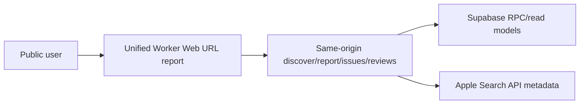
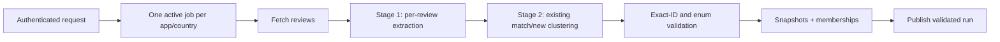

# VoC Radar 아키텍처

## 시스템 역할

- **Unified Worker**: Vite Web 정적 자산과 public/private/internal API를 같은 origin에서 제공합니다. API는 인증, 요청 dedupe·cooldown, cluster contract 검증, 캐시 갱신을 담당합니다.
- **Supabase**: Auth, 원문 리뷰, 실행 상태, issue identity/snapshot/membership을 저장합니다.
- **n8n**: queue claim, App Store 수집, 두 단계 AI 처리, 내부 API 호출을 담당합니다.

## 공개 read path

`/api/public/report`는 앱 메타, overview, category/trend, latest published cluster snapshots를 하나의 canonical 응답으로 합칩니다. 이슈 상세 RPC는 현재 snapshot의 membership만 따라 실제 review ID와 원문을 반환합니다.

## 분석 write path

- `pipeline_jobs.stage`: `queued → fetching → extracting → clustering → publishing`
- terminal status: `completed | failed | canceled`
- 최근 성공 publish 후 24시간 이내 요청은 `fresh` 결과와 다음 허용 시각을 반환합니다.
- 동일 앱·국가의 active job은 partial unique index와 Worker 사전 조회로 하나만 허용합니다.
- publish는 `pipeline_runs.validation_status='passed'`일 때만 허용됩니다.
- 클러스터링은 최대 40개 리뷰 단위로 1차 검증한 뒤, 후보 ID만 모델에 다시 제시해 배치 간 의미 중복을 통합합니다. 실제 review ID 합집합은 코드가 결정하며 후보와 전체 리뷰가 각각 정확히 1회 배정됐는지 publish 전에 재검증합니다.
- 운영 재분석 작업은 `pipeline_jobs.source='reanalysis'`로만 표시합니다. 이 경우 이미 저장된 리뷰도 extraction 입력으로 되돌리되, 일반 사용자의 24시간 cooldown 계약은 변경하지 않습니다. 같은 리뷰를 새 분류 계약으로 다시 해석한 run은 시계열 비교 대상이 아니므로 `changePercent`를 `null`로 저장합니다.
- 공개 이슈 목록·상세와 다음 실행의 cluster context는 앱·국가별 최신 `published + passed` run 하나에만 고정됩니다. 이전 run에만 존재하는 cluster는 새 리포트에 섞이지 않습니다.

## 데이터 모델

- `issue_clusters`: 앱·국가별 stable identity와 canonical key
- `issue_cluster_snapshots`: run별 canonical severity, 집계, 비교값, validation result
- `issue_cluster_reviews`: `(run_id, review_id)` primary key로 한 run에서 하나의 주 이슈만 허용
- `pipeline_runs`: model version과 validation result 저장

`change_percent`는 이전 snapshot의 review count가 있을 때만 계산하고, 비교 기준이 없으면 `null`입니다.

첫 화면의 앱 목록은 별도 추천이나 필수 샘플이 아니라 최근 `published_at` 순의 공개 리포트입니다. 조회 이벤트를 가장하기 위한 임의 데이터나 사용자 추적 테이블은 두지 않습니다.

## 보안과 rollout

- 내부 API는 `x-voc-token` 또는 HMAC 서명을 검증합니다.
- private API는 Supabase access token을 검증합니다.
- cluster 테이블은 anon/authenticated 직접 권한을 제거하고 security-definer RPC로 필요한 필드만 공개합니다.
- `REPORT_V2_ENABLED=true`가 현재 운영 기본값입니다. migration·workflow·재분석 전 단계나 긴급 롤백에서만 `false`로 내립니다.
- Web과 API는 `voc-radar.jeonsavvy.workers.dev`의 통합 Worker 하나에서 제공합니다. 기존 Cloudflare Pages 프로젝트는 자산·API·SPA deep link 검증 후 2026-07-21 제거했습니다.
- Web 롤백이 필요하면 보관한 배포 이력을 기준으로 Pages 프로젝트를 재생성하거나 이전 Worker 버전을 재배포합니다.
- 구 read model은 rollback 기간 동안만 유지하고 운영 검증 후 제거합니다.
