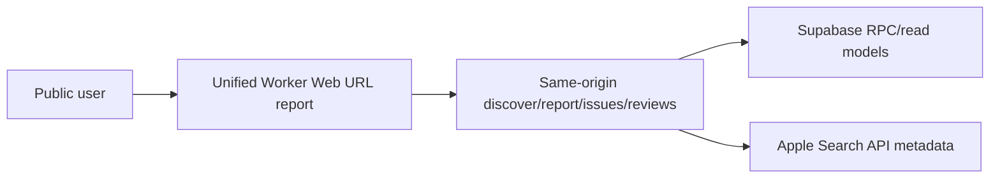

# VoC Radar 아키텍처

## 시스템 역할

- **Unified Worker**: Vite Web 정적 자산과 public/private/internal API를 같은 origin에서 제공합니다. 얇은 entry가 세 route 모듈을 dispatch하고, platform 모듈이 인증·Supabase 호출·오류 envelope·캐시 경계를 공유합니다.
- **Supabase**: Auth, 원문 리뷰, 실행 상태, issue identity/snapshot/membership을 저장합니다.
- **n8n**: queue claim, App Store 수집, 두 단계 AI 처리, 내부 API 호출을 담당합니다.

## 공개 read path

`/api/public/report`는 앱 메타, overview, category/trend, latest published cluster snapshots를 하나의 canonical 응답으로 합칩니다. 이슈 상세 RPC는 현재 snapshot의 membership만 따라 실제 review ID와 원문을 반환합니다.

## 분석 write path

```mermaid
flowchart LR
  R["Authenticated request"] --> J["One active job per app/country"]
  J --> Q["Idempotent claim + 15 minute lease"]
  Q --> F["Fetch reviews"]
  F --> E["Stage 1: per-review extraction"]
  E --> C["Stage 2: existing match/new clustering"]
  C --> V["Exact-ID and enum validation"]
  V --> P["Atomic snapshots + memberships"]
  P --> B["Atomic publish + job completion"]
```

- `pipeline_jobs.status`: `queued → running → completed | failed | canceled`
- `pipeline_jobs.stage`: `queued → fetching → extracting → clustering → publishing`
- n8n의 `$execution.id`가 `claim_key`이며 같은 key 재시도는 기존 job과 token을 반환합니다. claim lease는 15분이고 최대 시도는 3회입니다.
- 만료된 `running` 작업만 `queued`로 회수합니다. 세 번째 시도가 만료되면 `failed`로 종결하며 terminal 상태와 claim identity는 바꾸지 않습니다.
- claim 이후의 모든 내부 요청은 `jobId + claimToken + runId`를 전달합니다. 데이터 변경 RPC는 claim 검증과 쓰기를 같은 transaction에서 수행하므로 취소되거나 lease를 잃은 실행은 `409 job_claim_lost` 이후 상태나 데이터를 되살릴 수 없습니다.
- 최근 성공 publish 후 24시간 이내 요청은 `fresh` 결과와 다음 허용 시각을 반환합니다.
- 동일 앱·국가의 active job은 partial unique index와 Worker 사전 조회로 하나만 허용합니다.
- review 원문·extraction은 run별 비공개 staging에 묶이고, cluster identity·snapshot·membership 저장과 publish pointer·job 완료는 각 경계에서 transaction RPC로 원자적으로 처리합니다.
- 신규 raw review는 cluster membership FK를 위해 먼저 생성될 수 있지만 committed `review_ai`와 결합되기 전에는 공개 read model에 나타나지 않습니다. Publish transaction이 staged raw와 AI를 함께 병합하며 실패·취소·lease 만료 시 staging을 제거합니다.
- 새 title/category/model/last occurrence는 run snapshot에 staging되고, `pipeline_runs.validation_status='passed'`인 run만 publish됩니다. 실패하거나 미게시된 run은 기존 공개 metadata와 pointer를 바꾸지 않습니다.
- 클러스터링은 최대 40개 리뷰 단위로 1차 검증한 뒤, 후보 ID만 모델에 다시 제시해 배치 간 의미 중복을 통합합니다. 실제 review ID 합집합은 코드가 결정하며 후보와 전체 리뷰가 각각 정확히 1회 배정됐는지 publish 전에 재검증합니다.
- 운영 재분석 작업은 `pipeline_jobs.source='reanalysis'`로만 표시합니다. 이 경우 이미 저장된 리뷰도 extraction 입력으로 되돌리되, 일반 사용자의 24시간 cooldown 계약은 변경하지 않습니다. 같은 리뷰를 새 분류 계약으로 다시 해석한 run은 시계열 비교 대상이 아니므로 `changePercent`를 `null`로 저장합니다.
- 공개 이슈 목록·상세와 다음 실행의 cluster context는 앱·국가별 최신 `published + passed` run 하나에만 고정됩니다. 이전 run에만 존재하는 cluster는 새 리포트에 섞이지 않습니다.

## 데이터 모델

- `issue_clusters`: 앱·국가별 stable identity와 canonical key
- `issue_cluster_snapshots`: run별 canonical severity, 집계, 비교값, validation result
- `issue_cluster_reviews`: `(run_id, review_id)` primary key로 한 run에서 하나의 주 이슈만 허용
- `pipeline_review_ai_staging`: publish 전 run별 raw review·AI extraction 임시 저장소(service-role only)
- `pipeline_runs`: model version과 validation result 저장

`change_percent`는 이전 snapshot의 review count가 있을 때만 계산하고, 비교 기준이 없으면 `null`입니다.

첫 화면의 앱 목록은 최근 `published_at` 순의 공개 리포트입니다.

## 보안과 배포 조건

- 내부 API는 n8n HTTP node가 환경변수에서 직접 읽은 `x-voc-token`을 검증합니다. workflow item에는 token이나 파생 secret을 넣지 않습니다.
- private API는 Supabase access token을 검증합니다.
- cluster 테이블은 anon/authenticated 직접 권한을 제거하고 security-definer RPC로 필요한 필드만 공개합니다.
- migration·workflow·재분석·공개 API smoke test가 모두 통과할 때만 `REPORT_V2_ENABLED=true`로 전환합니다. 전환 조건과 확인 명령은 `docs/deployment-runbook.md`를 따릅니다.
- Web과 API는 같은 origin의 통합 Worker에서 제공합니다. 배포 후 root, SPA deep link, `/privacy`, `/api/health`를 확인합니다.
- 긴급 롤백에서는 관련 feature flag를 `false`로 내리고 새 workflow를 비활성화한 뒤 마지막으로 검증한 Worker 버전을 재배포합니다. Additive DB 컬럼과 RPC는 보존합니다.
